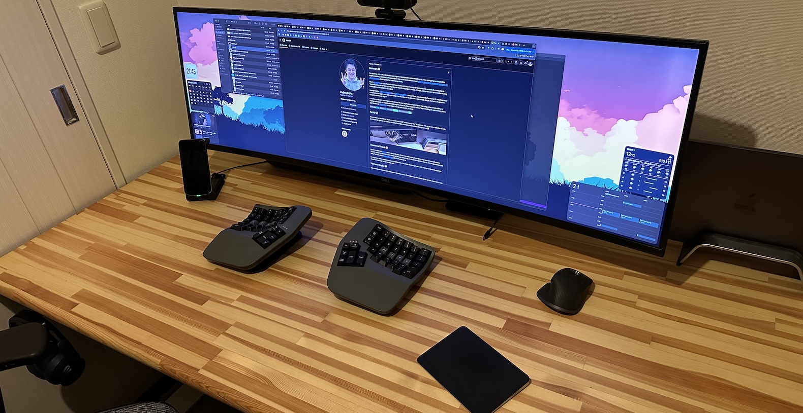
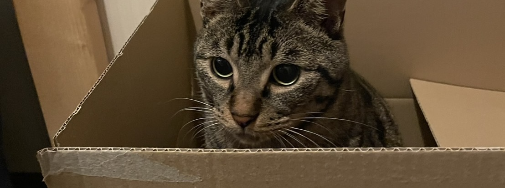

<h2>Biography 😏</h2>

I'm Japanese. With a Ph.D. in Machine Learning and a background in Information Science, I have strong programming abilities despite not being a dedicated software engineer. My current work centers around <a href="https://github.com/hajime-f/stocktrading">a Python-based automated trading program for Japanese stocks</a>, driven by Machine Learning algorithms.

According to the <a href="https://www.16personalities.com/">16 personalities test</a>, I'm a <a href="https://www.16personalities.com/entj-personality">Commander (ENTJ)</a> – just like Steve Jobs, apparently. I'm not sure if I should be happy or worried about that. It does make you wonder how they figured out Jobs was a Commander, though. It's hard to imagine him taking the test himself. Right?

I recently quit my soul-crushing corporate job and am now happily unemployed. For the time being, I plan to make a living by trading stocks using the trading program. However, if you happen to know of any interesting job opportunities, please don't hesitate to <a href="mailto:hajime.fujita@gmail.com">let me know</a>. I'm confident I can be quite useful ...probably.

  
  
  
  

<h2>Family 🐈</h2>

I have a wife, no children, but we have a cat named "Hoshi", which means "star" in Japanese. This cat is very attached to my wife, but completely ignores me. However, he sometimes hides behind my Macbook. So cute 🥰

<h2>Emacs and Dvorak 🥳</h2>

I've been a dedicated <a href="https://www.gnu.org/software/emacs/">Emacs</a> user for about 30 years. While most software engineers these days seem to have switched to VSCode, I remain stubbornly loyal to Emacs (or perhaps I should say, I'm unable to break free from it). And for approximately 25 years, I've been using a <a href="https://kinesis-ergo.com/keyboards/advantage360/">Kinesis keyboard</a> with the Dvorak layout.

For engineers, editors and keyboards are essential tools of the trade.  Since they're used daily, it's a good idea for everyone to choose one that they feel comfortable with.

<h2>Desk and Display 😁</h2>

I use an absolutely massive desk with a super-ultrawide monitor. This is the result of my quest for the perfect, most comfortable work environment.

The display is a 49-inch, 5120x1440 resolution behemoth. It arrived at my house in a ridiculously huge, coffin-sized cardboard box. Because it's absurdly wide, I can't even see the edges when I'm facing it directly. But, I love it. The expansive workspace is like the Sahara Desert – I can have my browser and Emacs open to my heart's content.

<h2>Hoshi again! 😍</h2>

Here's another picture of Hoshi. He's a very photogenic cat, don't you think? Despite being told not to enter my room, he sometimes sneaks in and relaxes. Just the other day, I found him inside an empty Amazon box I had left on the floor. 

I don't really understand why he comes into my room when he's not particularly attached to me, or why he always wants to get into empty boxes. But I can't bring myself to scold him, so I just let him do as he pleases.

<h2>GitHub Stats 😝</h2>

 
  
  

